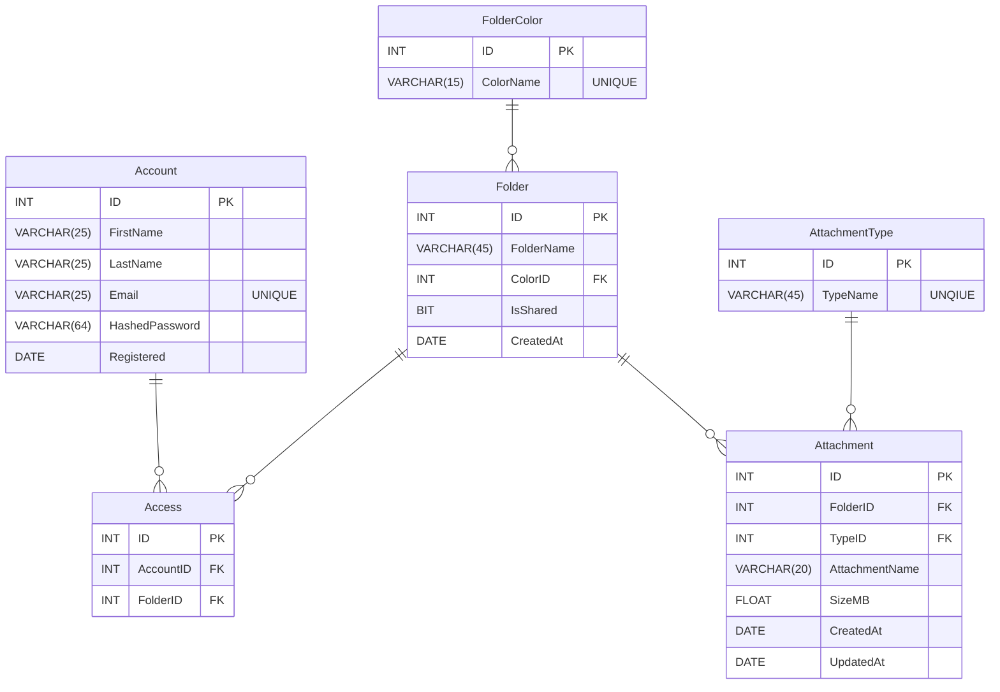

# Data Base Editor For User [DEFU]

 - My work on a school project. The goal was to create a simple possibility for the user to manage his database.

 > My project is customized for a specific database *(as an example)*. If you want to use it for your own purposes you will have to rewrite the **source code**.

## Table of contents
* [Introduction](#introduction)
* [How to use](#how-to-use)
* [How it works](#how-it-works)

## Introduction

The project I created was specifically adapted to work with a particular database, so it may not be practical or even possible to use it in other projects.

I aimed to create a user-friendly, functional and attractive interface so that users could use my work easily. This was my first big project within the Windows Forms App (.NET Framework), so there might be some bugs, flaws and sub-optimalities in the code.

I wanted to create an interface that was not only practical but also visually appealing, so I spent a lot of time developing it. I don't claim to be perfect and I know there is room for improvement, but at the moment I'm happy with what I've created and am willing to share my work with other users.

## How to use

1.  After downloading from *GitHub*, you will need to unlock the archive.
	 - **Right-click** on the archive. Select **Properties**, there will be a **Security** at the bottom. Select **Unlock** and **Apply** the changes.
2. You have two ways of starting a project:
	- In the project itself, navigate to the **bin** folder and then to the **Debug** folder. There you will find the ***DatabaseEditorForUser.exe*** file which you can open.
	- Or open with any **IDE** as ***DatabaseEditorForUser.sln***.
3. To make the database work, you need to create tables. 
	- The query script can be found in the **Resources/Database/Сloud.sql** project. Open this file in **SSMS** *(SQL Server Managment Studio)* and run **(F5)**. A new database will be created with already prepared **empty tables**. 
	- After that you can start the project.
4. Once started, a small window will open in which you can **connect** to the **local database** immediately, or click on the *gear icon* to set your own **connection parameters**.
	-  There is another method where you can set the connection parameters.
		- If you want to use an **.exe** file, you can manually set the connection in ***DatabaseEditorForUser.exe.config*** *(can be opened with Notepad)*.
		- For those who have opened a project in the **IDE**. The configuration file is located in the project itself under the name **App.config**.
5. After clicking on **Connet To Database** and successfully connecting to the database a new window will open in which you can import data from the **json file**. 
	- To do this click on **Import** in the *Homepage* and select one of the two files in **Resources/Database/Imports/** in the project.
	- If you have done everything correctly, all the data will be imported into the database and you can **work with it**.

### Config cheat sheet

| Keys (config)      | Explanation                                                                   |
|--------------------|-------------------------------------------------------------------------------|
| DataSource         | Name of your server.                                                           |
| IntegratedSecurity | True - requires no user input.  False - requires a user name and password. |
| InitialCatalog     | Name of database.                                                              |
| UserID             | User name.                                                                     |
| Password           | User password.                                                                 |

## How it works

### Structure of the database:

- The file `DEFUForm.cs` contains many interacting functions 
	- Switching between tables creates a new *instance* of a sub-form, which can be found in the **Subforms** folder in the project.
		- It is possible to create an **abstract class** and *inherit* all these forms *(Subforms)*. 
		- This would improve code readability as well as optimization.
	- **BUG**: If you press the *Refresh* button and then switch to another table and back, the **cool down** disappears.

- If you do not see some panels in the forms that are visible in the project. Hover your mouse over the empty panel space and then **right-click** and select `Send to Back`.
